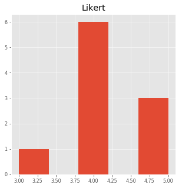
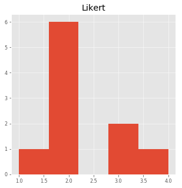

### Unpaired(Independent) Non Parametric Two-sample Mann–Whitney U test ###

***

**Where We Can Apply Unpaired Non Parametric Two-sample Mann–Whitney U test ?**

- two groups needs to be independent


### Outline for performing Unpaired Non Parametric Two-sample Mann–Whitney U test ###

1. Formulate Problem statement(research question) and hypothesis(two different type)
2. Import data
3. Check Appropriate data
4. compute Mann–Whitney U test
5. interpret result

### Implementation section ###

### 1. Problem statement(Research Question)
**Are Pooh's scores significantly different from those of Piglet?.**


### Formulate hypothesis ###

Two types:

If the distributions of the two groups are similar in shape and spread:   
•  Null hypothesis:  The medians of values for each group are equal.   
•  Alternative hypothesis (two-sided): The medians of values for each group are not equal.

If the distributions of the two groups are not similar in shape and spread:   
•  Null hypothesis:  The two groups exhibit stochastic equality.   
•  Alternative hypothesis (two-sided): The two groups do not exhibit stochastic equality.

**Important:two tailed hypothesis**

### 2. Import data ###


```python
import pandas as pd
```


```python
data=pd.read_csv("dataset/mwt.csv", skipinitialspace= True )
data['Speaker'] = data['Speaker'].map(lambda x: x.strip())

data.shape
```


    (20, 2)


```python
data.shape

```


    (20, 2)


### 3. Appropriate data ###

•  Two-sample data.  That is, one-way data with two groups only   
•  Dependent variable is ordinal, interval, or ratio   
•  Independent variable is a factor with two levels.  That is, two groups   
•  Observations between groups are independent.  That is, not paired or repeated measures data   
•  In order to be a test of medians, the distributions of values for each group need to be of similar shape and spread; outliers affect the spread.  Otherwise the test is a test of stochastic equality.   


```python
import scipy.stats as stats
import matplotlib.pyplot as plt
%matplotlib inline
import seaborn as sns
plt.style.use('bmh')
plt.style.use('ggplot')
plt.rcParams['figure.figsize'] = 20, 10
```


```python
Pooh=data[data['Speaker'] == 'Pooh']
Piglet=data[data['Speaker'] == 'Piglet']
```


```python
Pooh.hist(figsize=(5, 5), bins=5, xlabelsize=8, ylabelsize=8);
Piglet.hist(figsize=(5, 5), bins=5, xlabelsize=8, ylabelsize=8);
    
```








**Likert is the dependent variable and Speaker is the independent variable. **   
** Shape and distribution is not same so second hypothesis will used here.**


```python
stats.mannwhitneyu(Pooh.Likert, Piglet.Likert)
```


    MannwhitneyuResult(statistic=5.0, pvalue=0.00023567203407747563)


### Interpretation of Result ###

The p-value(0.00023)>0.05 which is false so we accept alternate hypothesis which is The two groups do not exhibit stochastic equality.
